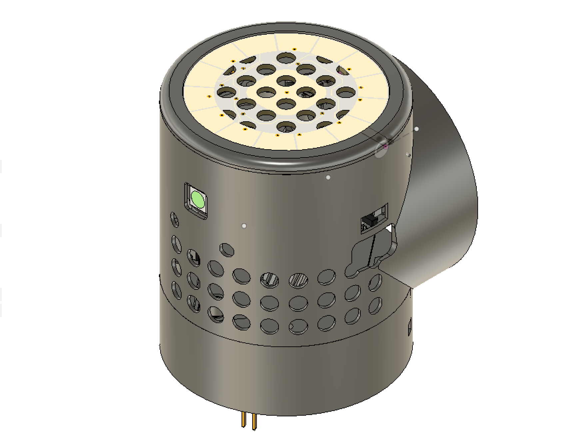
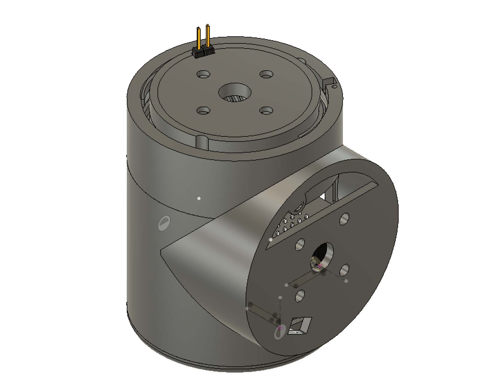
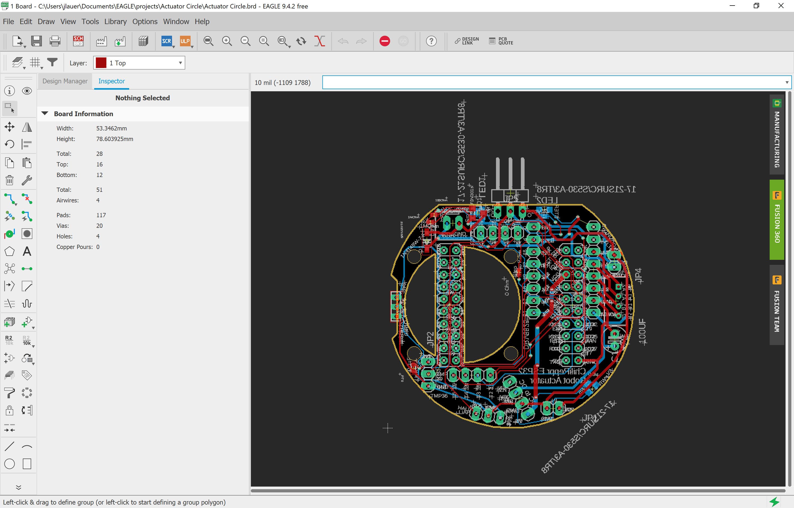
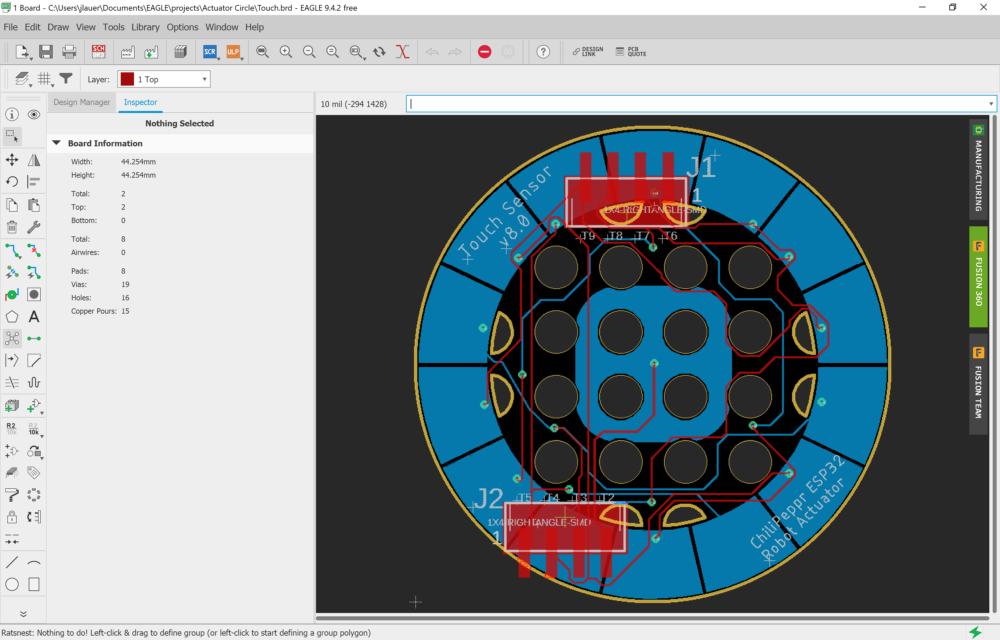
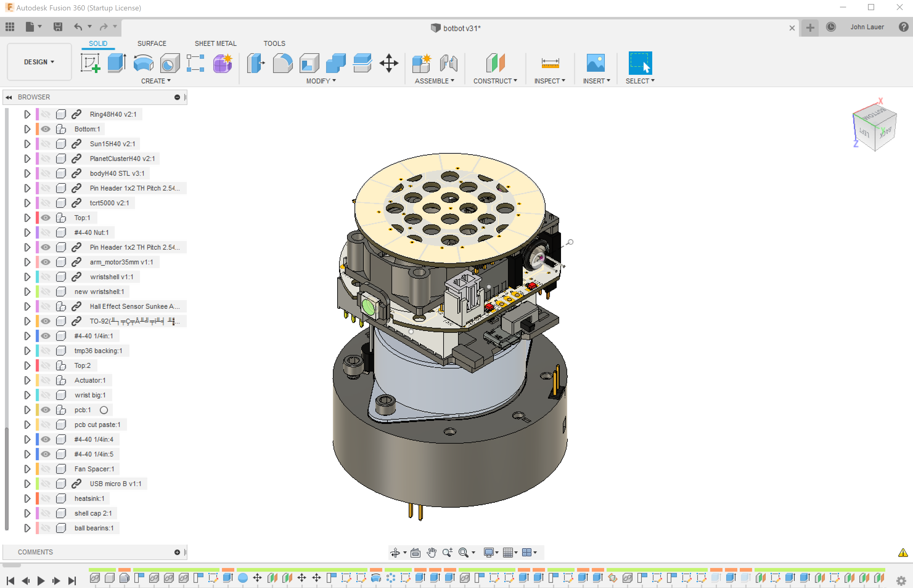
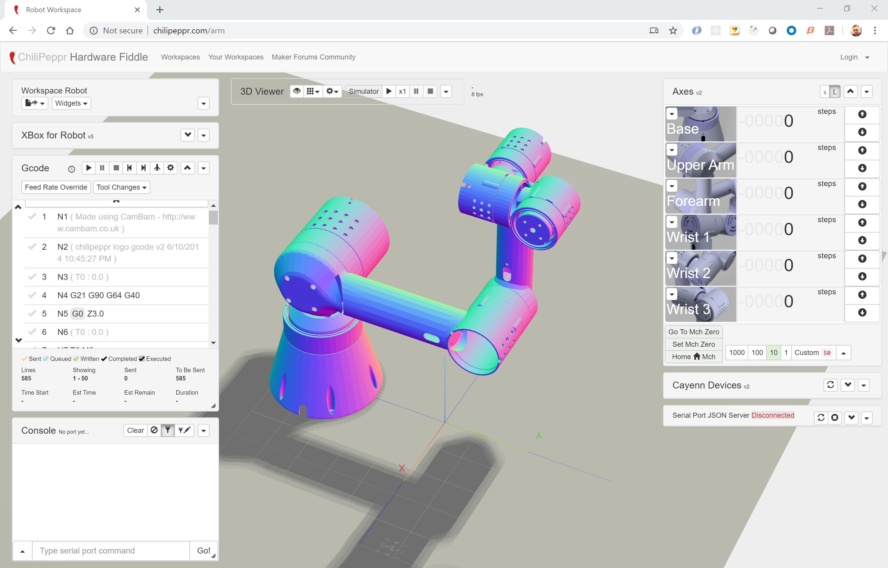
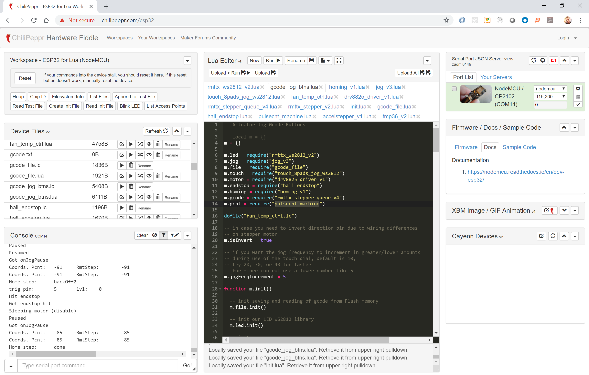
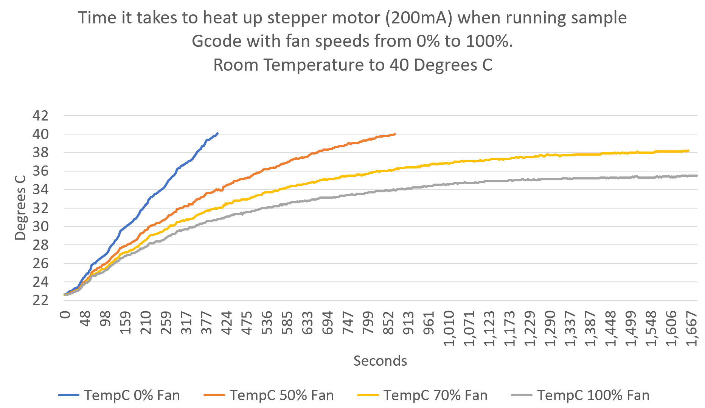

# robot-actuator-esp32-v8
This is the repo for the robot actuator v8 based on an ESP32 as the brains of each robot arm actuator.

This repository contains the latest design for the small actuator including:
- PCB schematic and board file (Eagle)
- Bill of Materials
- Fusion 360 files
- STL files for 3D printing
- NodeMCU ESP32 for Lua firmware with touch module, pulse counter module, RMT TX module, and gpiomatrix module.
- Lua code for actuator
- Link to ChiliPeppr http://chilipeppr.com/arm workspace to control the actuator and to ChiliPeppr ESP32 for Lua workspace for uploading code to the ESP32 device http://chilipeppr.com/esp32
- Heat management test results
- Youtube videos

This actuator is based on the amazing design of Jeff Kerr's (LoboCNC on Thingiverse) 3D printed robot arm WE-R2.4 six axis robot arm. https://www.thingiverse.com/thing:3327968

# Eagle Files

The main PCB board in Eagle.

The touch PCB board in Eagle.

# Fusion 360

The CAD files in Fusion360.

# ChiliPeppr

ChiliPeppr Robot Arm Workspace (Work in progress)
http://chilipeppr.com/arm

ChiliPeppr ESP32 for Lua Workspace for editing/uploading code
http://chilipeppr.com/esp32

# Heat Test

# Youtube Videos

Part 1
https://www.youtube.com/watch?v=tEbJV32GyYU

Part 2
https://www.youtube.com/watch?v=RdmdFIhCo4M

Part 3
https://youtu.be/4o3d7_WZ_DQ

