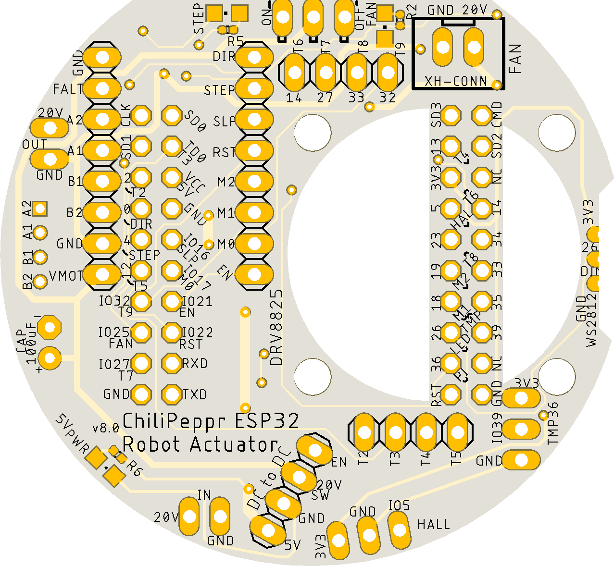

# robot-actuator-esp32-v8
This is the repo for the robot actuator v8 based on an ESP32 as the brains of each robot arm actuator.

This repository contains the latest design for the small actuator including:
- PCB schematic and board file (Eagle)
- Bill of Materials
- Fusion 360 files
- STL files for 3D printing
- NodeMCU ESP32 for Lua firmware with touch module, pulse counter module, RMT TX module, and gpiomatrix module.
- Lua code for actuator
- Link to ChiliPeppr http://chilipeppr.com/arm workspace to control the actuator and to ChiliPeppr ESP32 for Lua workspace for uploading code to the ESP32 device http://chilipeppr.com/esp32
- Heat management test results
- Youtube videos

This actuator is based on the amazing design of Jeff Kerr's (LoboCNC on Thingiverse) 3D printed robot arm WE-R2.4 six axis robot arm. https://www.thingiverse.com/thing:3327968

# Eagle Files

The main PCB board in Eagle.

Top

Bottom

The touch PCB board in Eagle.

# Fusion 360

The CAD files in Fusion360.

# ChiliPeppr

ChiliPeppr Robot Arm Workspace (Work in progress)
http://chilipeppr.com/arm

ChiliPeppr ESP32 for Lua Workspace for editing/uploading code
http://chilipeppr.com/esp32

# Heat Test

# Youtube Videos

Part 1
https://www.youtube.com/watch?v=tEbJV32GyYU

Part 2
https://www.youtube.com/watch?v=RdmdFIhCo4M

Part 3
https://youtu.be/4o3d7_WZ_DQ

<!-- # Pins Used on ESP32

|GPIO|Used|Input|Output|Notes|
|----|-----|------|-----|
|0|Yes|Yes|Yes|motor.pinDir|
|1|TX pin|OK|debug output at boot|
|2|OK|OK|connected to on-board LED|
|3|OK|RX pin|HIGH at boot|
|4|OK|OK|
|5|OK|OK|outputs PWM signal at boot|
|6|x|x|connected to the integrated SPI flash|
|7|x|x|connected to the integrated SPI flash|
|8|x|x|connected to the integrated SPI flash|
|9|x|x|connected to the integrated SPI flash|
|10|x|x|connected to the integrated SPI flash|
|11|x|x|connected to the integrated SPI flash|
|12|OK|OK|boot fail if pulled high|
|13|OK|OK|
|14|OK|OK|outputs PWM signal at boot|
|15|OK|OK|outputs PWM signal at boot|
|16|OK|OK|
|17|OK|OK|
|18|OK|OK|
|19|OK|OK|
|21|OK|OK|
|22|OK|OK|
|23|OK|OK|
|25|OK|OK|
|26|OK|OK|
|27|OK|OK|
|32|OK|OK|
|33|OK|OK|
|34|OK|input only|
|35|OK|input only|
|36|OK|input only|
|39|OK|input only| -->

# Bill of Materials

| Ref    | Part                                                   |  Price   |  Quantity  |  Ext Price  | URL                                                                                                                                                 | Notes                                                                                                                                                                                                                                                                                                                                                  |
|--------|--------------------------------------------------------|----------|------------|-------------|-----------------------------------------------------------------------------------------------------------------------------------------------------|--------------------------------------------------------------------------------------------------------------------------------------------------------------------------------------------------------------------------------------------------------------------------------------------------------------------------------------------------------|
|        |                                                        |          |            |             |                                                                                                                                                     |                                                                                                                                                                                                                                                                                                                                                        |
|        | PCB                                                    |          |            |  $-         |                                                                                                                                                     |                                                                                                                                                                                                                                                                                                                                                        |
|        | ESP32 Wemos Mini                                       |  $4.05   |  1         |  $4.05      | https://www.aliexpress.com/item/32839344778.html                                                                                                    |                                                                                                                                                                                                                                                                                                                                                        |
|        | 2x10 Pin Header Female for ESP32                       |  $0.12   |  2         |  $0.24      | https://lcsc.com/product-detail/Pin-Header-Female-Header_Boom-Precision-Elec-2-54mm-2-10-Straight-Female-header_C30867.html                         | Solder to the ESP32 board                                                                                                                                                                                                                                                                                                                              |
| C1     | 2x10 Pin Header Male for ESP32                         |  $0.10   |  1         |  $0.10      | https://lcsc.com/product-detail/Pin-Header-Female-Header_Shenzhen-Cankemeng-Headers-Pins-2-10P-2-54mm-Straight-line_C124359.html                    | Solder to main PCB                                                                                                                                                                                                                                                                                                                                     |
|        | DRV8825                                                |  $0.88   |  1         |  $0.88      | https://www.aliexpress.com/item/33010878323.html                                                                                                    | The most popular stepper driver out there. Simple and easy.                                                                                                                                                                                                                                                                                            |
|        | 100uF 50V Capacitor for DRV8825                        |  $0.13   |  1         |  $0.13      | https://lcsc.com/product-detail/Aluminum-Electrolytic-Capacitors-Leaded_PANASONIC-EEUFM1H101_C128473.html                                           | The big capacitor for stepper motor driver                                                                                                                                                                                                                                                                                                             |
|        | DC to DC 24V to 5V Converter                           |  $0.48   |  1         |  $0.48      | https://www.aliexpress.com/item/32796268715.html                                                                                                    | Little board from Aliexpress to get us to 5V on the cheap                                                                                                                                                                                                                                                                                              |
|        | Fan 25mm 12V                                           |  $1.08   |  1         |  $1.08      | https://www.aliexpress.com/item/33026177502.html                                                                                                    | Silent fan that we overdrive to 20v for brief periods if heat spikes, otherwise we leave it off                                                                                                                                                                                                                                                        |
| R3     | Fan Mosfet FDV301N 25V 220mA SOT-23                    |  $0.04   |  1         |  $0.04      | https://lcsc.com/product-detail/MOSFET_ON-Semicon_FDV301N_ON-Semicon-ON-FDV301N_C15310.html                                                         | Allows PWM speed control of fan. Run around 20Hz.                                                                                                                                                                                                                                                                                                      |
| R4     | Fan Diode Protector 100V 300mA SOD-123                 |  $0.02   |  1         |  $0.02      | https://lcsc.com/product-detail/Switching-Diode_DIODES_1N4148W-7-F_1N4148W-7-F_C83528.html                                                          | When fan switches off from Mosfet, it generates back current, so this diode lets it loop back into the fan to get absorbed                                                                                                                                                                                                                             |
|        | Fan 100Ohm gate resistor 0402                          |  $0.01   |  1         |  $0.01      | https://lcsc.com/product-detail/Chip-Resistor-Surface-Mount_100R-100R-1_C106232.html                                                                | Absorbs feedback attenuation                                                                                                                                                                                                                                                                                                                           |
|        | Fan 1MOhm pull-down resistor 0402                      |  $0.01   |  1         |  $0.01      | https://lcsc.com/product-detail/Chip-Resistor-Surface-Mount_1MR-105-5_C144054.html                                                                  | Pulldown resistor to ground to shut off mosfet                                                                                                                                                                                                                                                                                                         |
|        | JST XH Male Connector for fan                          |  $0.04   |  1         |  $0.04      | https://lcsc.com/product-detail/Wire-To-Board-Wire-To-Wire-Connector_JST-Sales-America_B2B-XH-A-LF-SN_JST-Sales-America-B2B-XH-A-LF-SN_C158012.html |                                                                                                                                                                                                                                                                                                                                                        |
|        | JST XH Crimp Connector for fan wire                    |  $0.01   |  2         |  $0.02      | https://lcsc.com/product-detail/New-Arrivals_JST-Sales-America-SXH-001T-P0-6N_C385122.html                                                          | In case you have to reterminate the fan wire, get these crimp connectors. You need a crimp tool.                                                                                                                                                                                                                                                       |
|        | JST XH Female Connector for fan wire                   |  $0.02   |  1         |  $0.02      | https://lcsc.com/product-detail/Rectangular-Connectors-Housings_JST-Sales-America_XHP-2_JST-Sales-America-XHP-2_C144401.html                        | In case you have to reterminate the fan wire, get this female housing to slide the crimp connectors into                                                                                                                                                                                                                                               |
|        | WS2812B White                                          |  $0.15   |  1         |  $0.15      | https://www.aliexpress.com/item/32960205936.html                                                                                                    | Break off one LED and solder to side of PCB at 90 degree angle. Connect center pin to DIN, not DOUT.                                                                                                                                                                                                                                                   |
|        | Red LED 0805                                           |  $0.02   |  3         |  $0.06      | https://lcsc.com/product-detail/Light-Emitting-Diodes-LED_0805-Red-LED-Iv-61mcd-Typ-atIF-20mA_C72037.html                                           | Indicator LEDs                                                                                                                                                                                                                                                                                                                                         |
| R5, R2 | 1KOhm current limit resistor for LED 0402              |  $0.01   |  2         |  $0.02      | https://lcsc.com/product-detail/Chip-Resistor-Surface-Mount_1KR-1001-1_C106235.html                                                                 | The LEDs on the 3.3v bus for step and fan indicator use 1K to give LED about 1ma of current so it lights up very dim, but enough to indicate status.                                                                                                                                                                                                   |
| R6     | 2KOhm current limit resistor for power LED 0402        |  $0.01   |  1         |  $0.01      | https://lcsc.com/product-detail/Chip-Resistor-Surface-Mount_Uniroyal-Elec-0402WGF2001TCE_C4109.html                                                 | The power LED is on a 5v bus. 2K gives it about 1.5ma of current for a dim indicator.                                                                                                                                                                                                                                                                  |
|        | 8 Pin Female Header 2.54mm                             |  $0.14   |  2         |  $0.28      | https://lcsc.com/product-detail/Pin-Header-Female-Header_Changjiang-Connectors-A2541HWV-8P_C225505.html                                             | 2 needed for DRV8825 connection to main PCB.                                                                                                                                                                                                                                                                                                           |
|        | 4 Pin Female Header 2.54mm                             |  $0.07   |  3         |  $0.22      | https://lcsc.com/product-detail/Pin-Header-Female-Header_Shenzhen-Cankemeng-Female-header-1-4P-2-54mm-Straight-line_C124413.html                    | 1 for DC to DC, 2 for touch sensor PCB connection                                                                                                                                                                                                                                                                                                      |
|        | 3 Pin Female Header 2.54mm                             |  $0.06   |  2         |  $0.11      | https://lcsc.com/product-detail/Pin-Header-Female-Header_Shenzhen-Cankemeng-22025403P00CKMT_C146690.html                                            | One for Hall sensor, one for TMP36.                                                                                                                                                                                                                                                                                                                    |
|        | 2 Pin Female Header 2.54mm                             |  $0.03   |  4         |  $0.10      | https://lcsc.com/product-detail/Pin-Header-Female-Header_Boom-Precision-Elec-2-54-1-2PFemale_C49661.html                                            | 2 for incoming 20v from slip ring. 2 for outgoing 20v to slip ring.                                                                                                                                                                                                                                                                                    |
|        | JST PH B4B-K-S Male Header for Stepper                 |  $0.17   |  1         |  $0.17      | https://lcsc.com/product-detail/Wire-To-Board-Wire-To-Wire-Connector_JST-Sales-America_B4B-PH-K-LF-SN_JST-Sales-America-B4B-PH-K-LF-SN_C265289.html | Socket soldered to PCB                                                                                                                                                                                                                                                                                                                                 |
|        | JST PHR-4 Female Header for Stepper Cable              |  $0.02   |  1         |  $0.02      | https://lcsc.com/product-detail/Connectors_JST_PHR-4_PHR-4-4P-pitch2-0mm-Plastic-shell_C111514.html                                                 | End of wire crimped connector                                                                                                                                                                                                                                                                                                                          |
| C2     | JST SPH Crimp Connector                                |  $0.01   |  4         |  $0.03      | https://lcsc.com/product-detail/Rectangular-Connectors-Contacts_JST_SPH-002T-P0-5S_SPH-002T-P0-5S-PH-T-PH-2-0_C111515.html                          | Individual crimp connectors. You'll need a crimping tool.                                                                                                                                                                                                                                                                                              |
|        | Toggle Switch                                          |  $0.12   |  1         |  $0.12      | https://lcsc.com/product-detail/Toggle-Switches_Korean-Hroparts-Elec-K3-1260D-L1_C92657.html                                                        | Toggle on/off the 20v to all components                                                                                                                                                                                                                                                                                                                |
|        | Pin Male Header Right Angle 2.54mm (40 pins breakaway) |  $0.44   |  2         |  $0.88      | https://www.digikey.com/product-detail/en/0022286043/WM22771-ND/3158673                                                                             | Right angle needed for touch sensor connection. Actually, I had to create my own right angle ones from straight ones to be long enough. They need to be about 10mm long from the touch PCB down to the pin headers, so buy the longest straight ones you can and bend them, then cut to size after you try to fit. Or, you can buy them from digikey.  |
|        | Pin Male Header Straight 2.54mm (40 pins breakaway)    |  $0.14   |  1         |  $0.14      | https://lcsc.com/product-detail/Pin-Header-Female-Header_Nextronics-Engineering-Z-211-4011-0021-001_C113597.html                                    | Break off all headers for the numerous areas that need a male header pin.                                                                                                                                                                                                                                                                              |
|        | 0.1uF Capacitor smoothing for TMP36                    |  $0.01   |  1         |  $0.01      | https://lcsc.com/product-detail/Others_Vishay-Intertech_VJ0402G104KXQCW1BC_Vishay-Intertech-VJ0402G104KXQCW1BC_C169292.html                         | TMP36 can give somewhat noisy temperature measurements. This cap on the input 3.3v on sensor can smooth out the output readings. You can operate without this cap since the software does multiple readings to average it.                                                                                                                             |
|        |                                                        |          |            |             |                                                                                                                                                     |                                                                                                                                                                                                                                                                                                                                                        |
|        | Actuator                                               |          |            |  $-         |                                                                                                                                                     |                                                                                                                                                                                                                                                                                                                                                        |
|        | Stepper Motor 35mm                                     |  $2.90   |  1         |  $2.90      | https://www.aliexpress.com/item/2054451318.html                                                                                                     | Cut off the PCB and resolder the 4 Pin silicone wire to the leads on the stepper. Make wire long enough you can connect to PCB while it's outside the actuator, around 4 to 6 inches.                                                                                                                                                                  |
|        | Neodymium Disc Mini Magnet 3x1.5mm                     |  $0.05   |  1         |  $0.05      | https://www.aliexpress.com/item/32949884024.html                                                                                                    | Magnet needed to trigger hall effect sensor                                                                                                                                                                                                                                                                                                            |
|        | Hall Effect Sensor SIP-3                               |  $0.14   |  1         |  $0.14      | https://lcsc.com/product-detail/Sensors_SK1816G-G03-K_C73293.html                                                                                   | Place into slot on bottom of 3D printed actuator, then place compression 3D printed backing to keep in place as close to magnet as you can.                                                                                                                                                                                                            |
|        | Heatsink 540/550 Motor                                 |  $1.00   |  1         |  $1.00      | https://www.aliexpress.com/item/33004830927.html                                                                                                    | Cut heatsink in half to service 2 actuators                                                                                                                                                                                                                                                                                                            |
|        | 4 Pin 30AWG Silicone Wire Ultra Flexible               |  $0.24   |  1         |  $0.24      | https://www.aliexpress.com/item/32870367030.html                                                                                                    | Use this wire to connect hall effect and TMP36 sensors to main PCB. Solder 3 wires to each sensor and then to 2.54mm standard 3 pin female headers.                                                                                                                                                                                                    |
|        | TMP36 Temperature Sensor TO-92                         |  $1.08   |  1         |  $1.08      | https://lcsc.com/product-detail/Temperature-Sensors_ADI_TMP36GT9Z_TMP36GT9Z_C53490.html                                                             | Temperature sensor is pushed against stepper motor to watch motor temp as it can get hot and melt the 3D printed parts, ruining the actuator.                                                                                                                                                                                                          |
|        |                                                        |          |            |  $-         |                                                                                                                                                     |                                                                                                                                                                                                                                                                                                                                                        |
|        |                                                        |  $13.78  |            |  $14.84     |                                                                                                                                                     |                                                                                                                                                                                                                                                                                                                                                        |
|        |                                                        |          |            |             |                                                                                                                                                     |                                                                                                                                                                                                                                                                                                                                                        |
|        |                                                        |          |            |             |                                                                                                                                                     |                                                                                                                                                                                                                                                                                                                                                        |
|        | Other Stepper Motors                                   |          |            |             |                                                                                                                                                     |                                                                                                                                                                                                                                                                                                                                                        |
|        | Higher end 35mm stepper Moon's                         |  $25.00  |  1         |  $25.00     | https://www.moonsindustries.com/p/35mm-permanent-magnet-stepper-motors/35pm048s8-08001-000004611120001819                                           | Not sure it's worth the money, but this motor is nice. I'm finding the cheaper motors are just about as good, but perhaps not as quiet or tight feeling as the Moon's.                                                                                                                                                                                 |
|        | Another cheap 35mm that's really nice                  |  $3.00   |  1         |  $3.00      | https://www.aliexpress.com/item/32975464158.html                                                                                                    | This is a very nice motor and cheap, but you have to grind off the gear on the 3mm shaft, which is painful.                                                                                                                                                                                                                                            |

